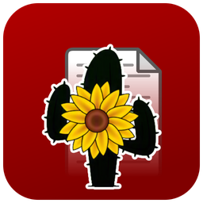
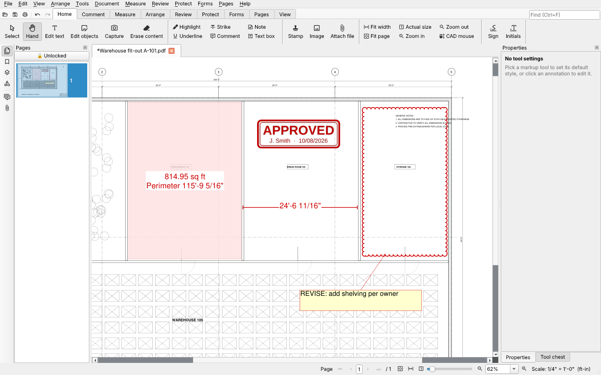
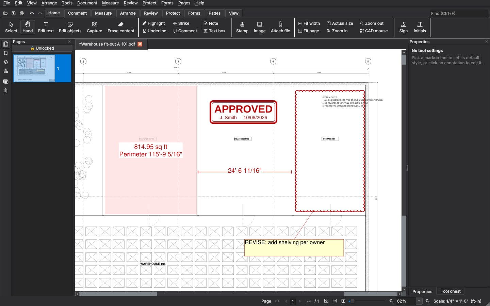

  

<h1 align="center">KanzonasPDF</h1>

  <b>A free, fast PDF reader and editor for Windows</b> 
  Mark up, measure, edit, sign and redact PDFs, with no subscription, no account and no ads.

  <a href="https://github.com/keithlyding/KanzonasPDF/releases"><b>Download for Windows</b></a> ·
  <a href="#getting-started">Getting started</a> ·
  <a href="#feedback">Report a bug</a>

> **Beta:** KanzonasPDF is under active development (version 0.x). It's used daily, and every
> build is tested automatically, but you may still find rough edges. Please
> [tell us](#feedback) when something doesn't work, and keep a copy of important files.

## What it does

**Read and navigate**
- Tabs, fast scrolling and zoom even on huge CAD sheets, page thumbnails, bookmarks, layers
- Find with every match highlighted; split view to see two places at once
- Light, dark or match-Windows theme; ribbon or classic toolbars

**Mark up and review**
- Highlight, underline, strike out, comment on text, sticky notes, text boxes, callouts
- Rectangles, ellipses, revision clouds, polygons, lines, arrows, freehand pen
- Stamps (Approved, Reviewed, Draft and more, or your own), with your name and the date
- A tool chest of saved markup styles, a markups list you can filter and export, and
  Compare documents to cloud every change between two revisions
- Markups are standard PDF annotations, so Acrobat and other viewers see them too

**Measure** (for drawings and plans)
- Set the scale from a preset (1/4" = 1'-0", 1:100, ...) or by calibrating a known dimension
- Length, polylength, area and perimeter, and counts, with a measurement summary you can
  export to CSV
- CAD-style mouse (the wheel zooms, hold it to pan) and snapping to the drawing

**Edit the PDF itself**
- Edit text in place; move, resize, rotate or delete the page's own pictures and vector shapes
- Erase content in an area, capture an area as sharp vector content, add backgrounds,
  watermarks, headers and footers, page numbers and Bates numbering
- Pages: rotate, reorder, insert, extract, combine files

**Sign, protect and clean up**
- Your signature and initials (drawn or scanned), digital signatures with a certificate,
  passwords and permissions
- True redaction that removes the text underneath, including from hidden places like
  metadata and form fields
- Recognize text (OCR) in scanned pages, offline

**Forms and export**
- Fill in and create forms
- Export to Word, Excel, PowerPoint, AutoCAD DXF, images and text

**Built to stay fast and light:** it starts in well under a second, and every build checks
start-up time and memory automatically. There's no background service, no account and no
telemetry. It only goes online to check whether a newer version exists (you can turn that off)
and, if you add a trusted timestamp to a digital signature, to contact a timestamp server.

## Download and install

Download from the [Releases page](https://github.com/keithlyding/KanzonasPDF/releases).
Pick **one** of these files from the newest release:

| File | What it is |
| --- | --- |
| `KanzonasPDF-v…-setup.exe` | **Installer (recommended).** No administrator rights needed. It can add a desktop shortcut and offer KanzonasPDF as an app for opening PDFs. |
| `KanzonasPDF-v…-portable.zip` | **No installation.** Unzip anywhere (even a USB stick) and run `KanzonasPDF.exe`. Settings, signatures and stamps stay in a `data` folder next to it. |
| `KanzonasPDF-v…-windows.zip` | The same program as the portable version, but it keeps its settings in your Windows profile. |

### "Windows protected your PC"

KanzonasPDF isn't code-signed yet (a signing certificate costs money every year), so Windows
SmartScreen may warn you the first time you run it, simply because it doesn't recognize a new
program yet. To run it anyway, click **More info**, then **Run anyway**.

Only do this with files downloaded from this project's
[Releases page](https://github.com/keithlyding/KanzonasPDF/releases). Every release is built
from the public source code in this repository by GitHub's own build servers, and tested there
before it's published.

### Updating and uninstalling

- KanzonasPDF tells you when a newer version is out (Help > Check for updates...). It only
  tells you; it never installs anything by itself.
- To update, run the new installer: it replaces the old version and keeps your settings,
  signatures, stamps and tool chest.
- To uninstall, use Windows Settings > Apps.

## Getting started

- **Open a PDF:** drag it onto the window, or File > Open. Several PDFs open as tabs.
- **The user manual is built in:** press **F1** (Help > User manual). It covers every tool,
  menu command and keyboard shortcut.
- **Make it yours:** File > Preferences (**Ctrl+K**) has your name for markups, your signature,
  default markup styles, the zoom documents open at, mouse and scrolling options, automatic
  backups and more.
- **Keyboard shortcuts:** View > Keyboard shortcuts... lists them all, and you can change them.

## Feedback

- **Found a bug or have an idea?** Open an
  [issue](https://github.com/keithlyding/KanzonasPDF/issues/new/choose). Please describe what
  you did and what happened, and **don't attach confidential PDFs**.
- **Security problem** (redaction, passwords, signatures): please report it privately, as
  described in [SECURITY.md](SECURITY.md).
- **Want to contribute?** See [CONTRIBUTING.md](CONTRIBUTING.md) and the
  [Code of Conduct](CODE_OF_CONDUCT.md).

## Known limitations

- Windows only.
- Saving changes to a digitally signed file invalidates its signatures (an unchanged signed
  file is saved as an exact copy).
- Text editing works one line at a time; it doesn't reflow the rest of a paragraph. If the
  original font isn't available, a close standard font is used.
- Edit objects works on pictures and vector shapes, not on text, and not on content grouped
  inside form XObjects.
- Password permissions are honored by Acrobat, PDF-XChange and this app, but they aren't
  tamper-proof; use a digital signature to prove a file hasn't changed.
- A personal certificate proves a document is unchanged, but other people's software shows your
  identity as verified only if they trust your certificate (or you use one from a certificate
  authority). Signing with the Windows certificate store or smart cards isn't supported yet.
- Export: Word works best for ordinary text documents; Excel needs real (not scanned) tables;
  PowerPoint slides are page pictures; AutoCAD export is DXF (not DWG) and leaves out images.
- OCR caps large sheets at 6000 px on the long side, so very small text on big drawings may be
  missed.

## For developers

KanzonasPDF is written in Python with [PyMuPDF](https://pymupdf.readthedocs.io/) (MuPDF) and
Qt ([PySide6](https://doc.qt.io/qtforpython-6/)). Project rules for changes are in
[CLAUDE.md](CLAUDE.md).

**Run from source (Windows):** install Python 3.10+ from https://www.python.org/downloads/
(tick "Add to PATH"), then double-click **`Start KanzonasPDF.bat`** (the first time, it installs
the libraries it needs). Or: `pip install -r requirements.txt`, then `python run.py`.

**Self-test:** `python -m kanzonas --selftest selftest.log` checks the main features, the
manual and the performance budget. The Windows build runs it on the packaged app, the installer
and an upgrade.

**Build an .exe:** double-click `build_windows.bat`; the app ends up in
`dist\KanzonasPDF\KanzonasPDF.exe`.

**Releases publish themselves:** when `main` gets a new `__version__` (in
`kanzonas/__init__.py`), usually by merging a pull request, and the build passes, the tested
installer and zips are published as release `v<version>` (a pre-release while the version is
0.x). Other branches build and test but don't publish. To change this, set the repository
variable `AUTO_RELEASE` (Settings > Secrets and variables > Actions > Variables): `draft` makes
a draft release to publish by hand; `false` turns releasing off.

**CAD test drawings:** `python tests/cad_samples.py DIR` generates realistic plotted CAD sheets
(including a 42x30 site plan with ~139,000 contour segments and a scanned sheet);
`python tests/cad_battery.py DIR` runs the app's features against them and prints timings.

## Credits

App icon and logo: the owner's artwork in `assets/` (after changing them, run
`python tools_make_assets.py`). Toolbar icons: the Material Design Icons font that ships with
QtAwesome.

## License

KanzonasPDF is free software under the [GNU AGPL-3.0](LICENSE). It's built on PyMuPDF, which is
AGPL-3.0, so KanzonasPDF's source code is always available here.
